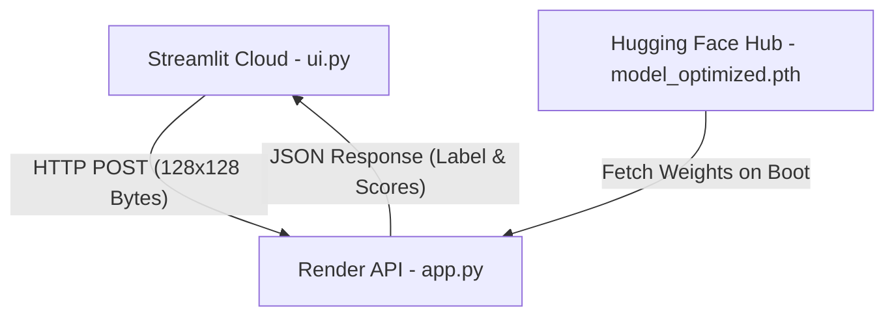

# 🔍 AI Image Detector


A binary image classification application designed to detect whether an image is **Real** or **AI-Generated**. Built using PyTorch, FastAPI, and Streamlit, optimized for zero-cost cloud infrastructure.

---

## 🌐 Live Demos

* **Frontend App (Streamlit Cloud):** https://ai-image-detector-7tu4kdqog2uvjhrg4jrevo.streamlit.app/
* **Backend API (Render):** https://ai-image-detector-api-br5c.onrender.com

> **Note on Free-Tier Hosting:**  
> Render puts inactive instances to sleep after 15 minutes. The initial inference request may take 30–45 seconds while the backend spins up and downloads model weights. Subsequent requests respond instantly.

---

## 🏗 System Architecture



---

## ⚡ Memory & Performance Optimizations

To maintain a **100% free deployment** under Render's **512 MB RAM limit**, the pipeline applies several performance safeguards:

* **Client-Side Pre-Resizing (`ui.py`):** Resizes images to `128x128` pixels locally before network transmission. Reduces payload sizes from ~5 MB to ~15 KB and eliminates memory spikes on the backend.
* **Hugging Face Hub Model Storage:** Model weights (`model_optimized.pth`) are dynamically fetched via `hf_hub_download` at startup, keeping GitHub repository size minimal.
* **CPU Single-Threading (`app.py`):** Configured with `torch.set_num_threads(1)` and `torch.set_num_interop_threads(1)` to limit thread pool allocations.
* **Zero-Autograd Inference:** Enforces `torch.inference_mode()` during classification to bypass gradient graph creation.
* **Explicit Garbage Collection:** Uses `del` and `gc.collect()` post-inference to flush image tensors from memory immediately.

---

## 📂 Project Structure
```text
.
├── app.py                # FastAPI REST server & PyTorch inference logic
├── ui.py                 # Streamlit web interface with client-side preprocessing
├── model.py              # Neural network architecture definition
├── requirements.txt      # Project dependencies (CPU-only PyTorch)
└── README.md             # Documentation
```


---

## 🚀 Local Setup

### 1. Clone Repository

git clone https://github.com/Yreactives/ai-image-detector.git
cd ai-image-detector

### 2. Install Dependencies

pip install -r requirements.txt

### 3. Run FastAPI Backend

uvicorn app:app --reload --port 8000

Interactive API docs will be available at https://ai-image-detector-api-br5c.onrender.com/docs.

### 4. Run Streamlit Frontend

In a separate terminal session:

streamlit run ui.py

---

## 📡 API Specification

### POST /predict

Accepts an image file and returns classification predictions.

#### Form Data
* `image`: Multipart file upload (`.jpg`, `.jpeg`, `.png`)

#### Sample Response (200 OK)
{
  "label": "AI Generated",
  "confidence": 98.45,
  "scores": {
    "ai_generated": 0.9845,
    "real_image": 0.0155
  }
}

---

## 🛠 Tech Stack

* **Machine Learning:** PyTorch, Torchvision
* **Backend Service:** FastAPI, Uvicorn
* **Frontend Web App:** Streamlit, Pillow
* **Model Storage:** Hugging Face Hub
* **Cloud Infrastructure:** Render (Backend), Streamlit Community Cloud (Frontend)
